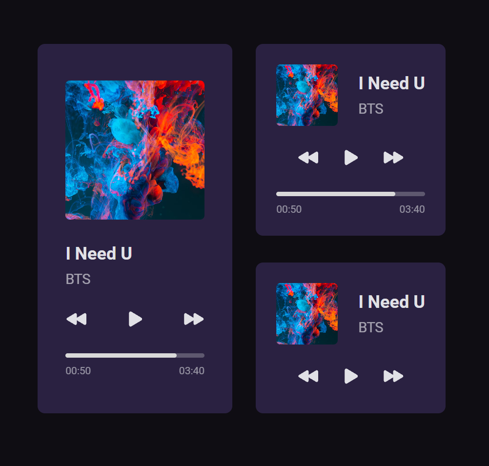

# Desafio #01 - Player de Música

Primeiro desafio do #boraCodar promovido pela Rocketseat. Nessa primeira semana o objetivo era reproduzir um player de música utilizando como base o seguinto layout: [Desafio #01](https://www.figma.com/file/Ci0pvTzR5I0SRHBOvEZMIF/%23boraCodar---Desafio-1-(Community)?node-id=0%3A1&t=Ifibi1MOMM71QR8Y-1).

### Resultado final:
